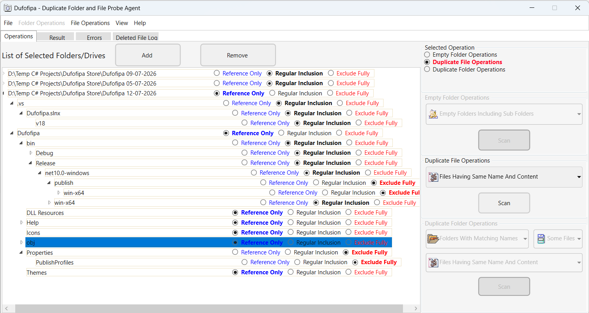

# Dufofipa
## Main Window Overview - Light Theme

## Main Window Overview - Dark Theme

## Duplicate File, Duplicate Folder and Empty Folder Finder for Windows

**Dufofipa (Duplicate Folders and Files Probe Agent)** is a Windows desktop application designed to help users find and manage **duplicate files, duplicate folders containing files, and empty folders**.

Dufofipa allows you to scan selected locations, identify potential duplicates, compare files to determine whether their contents are identical, have identical names or both, review scan results, mark items for operations and then perform supported operations on them.

> **Important:** Always review scan results carefully before deleting, moving, or copying files or merging folders. Keep appropriate backups of important data before performing file-management operations.

---

## Download Dufofipa

### Latest Release

**[Download Dufofipa v1.1.0 from GitHub Releases](https://github.com/Shakeel-Software-Enterprises/Dufofipa/releases/tag/v1.1.0)**

Dufofipa is distributed through the official **Shakeel Software Enterprises GitHub repository**.

Two installation options are available:

### Recommended: Standalone Version

**[Download: Dufofipa-Setup-1.1.0-Standalone.exe](https://github.com/Shakeel-Software-Enterprises/Dufofipa/releases/download/v1.1.0/Dufofipa-Setup-1.1.0-Standalone.exe)**

The **Standalone** version is a self-contained installation that includes the required .NET runtime components.

Choose this version if you:

* Do not already have the required .NET 10 Windows Desktop Runtime installed.
* Prefer an installation that does not require a separate .NET runtime installation.
* Want the simpler installation experience.

The **Microsoft Edge WebView2 Runtime** is still required for Dufofipa's integrated Help system. The Standalone installer is larger because it includes the required WebView2 Runtime installer.

### Standard Version

**[Download: Dufofipa-Setup-1.1.0.exe](https://github.com/Shakeel-Software-Enterprises/Dufofipa/releases/download/v1.1.0/Dufofipa-Setup-1.1.0.exe)**

The **Standard** version is a framework-dependent installation.

Choose this version if the required **Microsoft .NET 10 Windows Desktop Runtime** is already installed on your computer.

Advantages include:

* Smaller application download.
* Uses the .NET runtime already installed on the computer.
* Suitable for systems that already have the required .NET 10 runtime.

The Standard version requires:

* Microsoft .NET 10 Windows Desktop Runtime.
* Microsoft Edge WebView2 Runtime for the integrated Help system.

If a required runtime is missing, the installer will guide you to the appropriate official Microsoft download page.

---

## What Can Dufofipa Do?

Dufofipa finds and lists the empty folders, duplicate files and duplicate folders according to user specified parameters from the selected drives/folders and subfolders. It  provides tools for further analysis and management of the identified items.

### Find Empty Folders

<table>
  <tr>
    <td align="center">
      
       
      <em>Displaying Empty Folder List - Light Theme</em>
    </td>
    <td align="center">
      
       
      <em>Displaying Empty Folder List - Dark Theme</em>
    </td>
  </tr>
</table>

Scan selected locations to identify folders that contain no files or contain folders which could be potentially treated as empty. See help for further information.

### Find Duplicate Files

<table>
  <tr>
    <td align="center">
      
       
      <em>Displaying Duplicate File List - Light Theme</em>
    </td>
    <td align="center">
      
       
      <em>Displaying Duplicate File List - Dark Theme</em>
    </td>
  </tr>
</table>
Scan selected locations to identify files that may be duplicates and compare files to determine whether their contents and or names are identical.

### Find Duplicate Folders
<table>
  <tr>
    <td align="center">
      
       
      <em>Displaying Duplicate Folders with Files List - Light Theme</em>
    </td>
    <td align="center">
      
       
      <em>Displaying Duplicate Folders with Files List - Dark Theme</em>
    </td>
  </tr>
</table>
Identify and list duplicate folders having identical names and may contain files which may be identical in content or name. User can select parameters for the search based on options.  Further parameters can be set for folder and file comparison operations.

### Review Results Before Taking Action

Review the results of a scan before deciding what to do with the identified files or folders.

### Manage Files and Folders

Perform supported operations on selected files and folders, including removing, moving, or merging items where supported.

### Integrated Help

Dufofipa includes an integrated Help system to assist users in understanding and using the application.

---

## Why Dufofipa?

Dufofipa is designed around a simple workflow:

**Scan → Analyze → Review → Mark → Take Action**

Rather than immediately deleting/moving/copying files after a scan, Dufofipa allows users to examine the results and select the files or folders on which they want to perform an operation. Among other things, this feature allows users to verify duplicates before any operations are executed on the files or folders.

This is particularly important when working with duplicate files and folders because files with similar names are not necessarily identical.

Always verify the results before deleting or modifying data.

---

## Privacy and Local File Processing

Dufofipa is a Windows desktop application that operates on files and folders selected by the user.

The primary scanning and file-management operations are performed **locally on the user's computer**.

Dufofipa does not require users to:

* Create an online account to perform its primary file and folder scanning functions.
* Upload their files to an online service in order to perform its primary functions.

Your files do not need to be uploaded to a cloud service for Dufofipa's primary scanning and file-management operations.

Users should nevertheless review the application's behavior and permissions before using it with sensitive or important data.

---

## System Requirements

### Operating System

The current release requires a **64-bit Windows environment** compatible with the application's .NET 10 Windows Desktop Runtime requirements.

### Standard Version

The Standard version requires:

* Microsoft .NET 10 Windows Desktop Runtime.
* Microsoft Edge WebView2 Runtime for the integrated Help system.

### Standalone Version

The Standalone version includes the required .NET runtime components.

The Microsoft Edge WebView2 Runtime is still required for the integrated Help system.

---

## Microsoft Edge WebView2 Runtime

Dufofipa uses **Microsoft Edge WebView2** for its integrated Help system.

If WebView2 Runtime is not available on your computer, the installer will guide you to the official Microsoft WebView2 download page.

For security and reliability, always obtain WebView2 Runtime from the official Microsoft website.

Official Microsoft WebView2 download page:

https://developer.microsoft.com/en-us/microsoft-edge/webview2/

---

## Installation

### Standard Version

1. Download the Standard installer from the official Dufofipa GitHub Releases page.
2. Run the installer.
3. Follow the installation instructions.
4. If the required .NET 10 Windows Desktop Runtime is not detected, follow the instructions provided by the installer.
5. If WebView2 Runtime is required, follow the instructions provided by the installer.
6. Complete the installation.
7. Launch Dufofipa from the Windows Start Menu or from the Desktop shortcut if one was created.

### Standalone Version

1. Download the Standalone installer from the official Dufofipa GitHub Releases page.
2. Run the installer.
3. Follow the installation instructions.
4. If WebView2 Runtime is required, follow the instructions provided by the installer.
5. Complete the installation.
6. Launch Dufofipa from the Windows Start Menu or from the Desktop shortcut if one was created.

---

## Desktop Shortcut

During installation, you can choose whether to create a Desktop shortcut.

If the Desktop shortcut option is selected, Dufofipa can be launched directly from the Windows Desktop.

If the option is not selected, Dufofipa remains available through the Windows Start Menu.

---

## Getting Started

After launching Dufofipa:

1. Select the appropriate operation.
2. Add the folders or locations you want to examine.
3. Start the selected scan.
4. Wait for the scan to complete.
5. Review the results carefully.
6. Select or mark the files or folders on which you want to perform an operation.
7. Perform the desired operation.

Because file-management operations may affect data on your computer, always review the results carefully before confirming an operation.

It is strongly recommended that important personal data be backed up before performing operations that delete, move, or otherwise modify files.

---

## Safety and Data Protection

Dufofipa is a file-management utility. Some operations may result in files or folders being moved, deleted, or otherwise modified.

Before performing an operation:

* Review the scan results carefully.
* Confirm that the selected files and folders are the intended ones.
* Keep backups of important data.
* Do not delete files solely because they appear to have the same name.
* Verify duplicate-file results before deleting anything.
* Be particularly careful when working with system folders or application directories.

The user is responsible for reviewing and confirming operations performed using Dufofipa.

---

## Application Data

Dufofipa may create application data required for its operation, including temporary data used to support application operations.

The application stores its temporary operational data in the appropriate user-accessible application data location rather than requiring routine write access to the application's installation directory or system-protected folders.

---

## Release Information

### Dufofipa 1.1.0

**Release Type:** First Public Release

Dufofipa 1.1.0 is the first public release of the application.

This release provides two installation options:

* Standard Installer
* Standalone Installer

For detailed release-specific information, see the [release notes associated with the v1.1.0 GitHub Release](https://github.com/Shakeel-Software-Enterprises/Dufofipa/releases/tag/v1.1.0).

---

## Documentation

Additional documentation and Help resources are provided with the application where applicable.
<table>
  <tr>
    <td align="center">
      
       
      <em>Displaying Integrated Help Index Page - Light Theme</em>
    </td>
    <td align="center">
      
       
      <em>Displaying Integrated Help Folder Scan Permission Page - Light Theme</em>
    </td>
  </tr>
</table>

For application-specific guidance, refer to the integrated Help system included with Dufofipa.

---

## End User License Agreement

Dufofipa is distributed subject to the applicable **End User License Agreement (EULA)**.

Please read the EULA before installing or using the software.

The EULA is provided with the official release package and is also presented during installation.

**[Download EULA: Dufofipa-EULA.docx](https://github.com/Shakeel-Software-Enterprises/Dufofipa/releases/download/v1.1.0/Dufofipa-EULA.docx)**

By installing or using Dufofipa, you agree to the applicable terms and conditions of the EULA.

---

## Support and Bug Reports

If you encounter a problem with Dufofipa, please provide as much information as possible when reporting the issue.

Useful information includes:

* Dufofipa version.
* Windows version.
* Whether you are using the Standard or Standalone version.
* A description of the problem.
* Steps required to reproduce the problem.
* Relevant error messages.
* Screenshots, where appropriate.
* Any relevant information about the files or folders involved.

Please do not include personal or sensitive information in a public issue report.

Bug reports and feature requests can be submitted through the **Issues** section of the Dufofipa GitHub repository.

---

## Project Information

**Dufofipa**

*Duplicate Folders and Files Probe Agent*

Developed and maintained by:

**Shakeel Software Enterprises**

Official GitHub repository:

https://github.com/Shakeel-Software-Enterprises/Dufofipa

---

## Source Code

The Dufofipa source code is maintained privately by **Shakeel Software Enterprises** and is not publicly distributed through this repository.

This public repository is intended for distributing:

* Dufofipa installers.
* Official releases.
* Release information.
* Documentation.
* EULA and associated public release materials.

---

## License

Dufofipa is distributed under the terms specified in the accompanying End User License Agreement.

The software, installers, documentation, and associated materials remain the property of **Shakeel Software Enterprises**, unless otherwise stated.

---

## Disclaimer

Dufofipa is provided subject to the terms of the applicable End User License Agreement.

Although care is taken in the development and testing of the application, users should maintain appropriate backups of important data before performing file-management operations.

Shakeel Software Enterprises is not responsible for data loss resulting from the use or misuse of the software, to the extent permitted by applicable law and subject to the terms of the applicable End User License Agreement.

---

© 2026 Shakeel Software Enterprises. All rights reserved.
